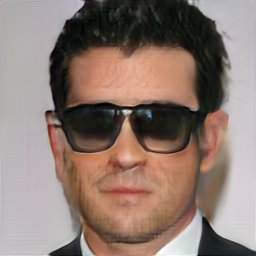

# balanced-pioneer
Towards Photographic Image Manipulation with Balanced Growing of Generative Autoencoders



<br/>


<br/>


Figure: For real input images (far left), our model can change various features that it has learnt in a fully unsupervised manner.

## Non-technical Summary

PIONEER is a generative neural network model that learns how certain kinds of images, such as faces, are structured.
It can be used to modify your input images in various smart ways (e.g. change the expression, make a male face more feminine, etc.) without losing sharpness in the output. The best-known generative models, GANs, cannot normally make this kind of general modifications to *existing input images*.

This paper marks a jump in resolution and quality of the face images over the previous PIONEER incarnation, and makes the feature modifications more explicit.

## Abstract

We build on recent advances in progressively growing generative autoencoder models. These models can encode and reconstruct existing images, and generate novel ones, at resolutions comparable to Generative Adversarial Networks (GANs), while consisting only of a single encoder and decoder network. The ability to reconstruct and arbitrarily modify existing samples such as images separates autoencoder models from GANs, but the output quality of image autoencoders has remained inferior. The recently proposed PIONEER autoencoder can reconstruct faces in the 256x256 CelebAHQ dataset, but like IntroVAE, another recent method, it often loses the identity of the person in the process. We propose an improved and simplified version of PIONEER and show significantly improved quality and preservation of the face identity in CelebAHQ, both visually and quantitatively. We also show evidence of state-of-the-art disentanglement of the latent space of the model, both quantitatively and via realistic image feature manipulations. On the LSUN Bedrooms dataset, our model also improves the results of the original PIONEER. Overall, our results indicate that the PIONEER networks provide a way to photorealistic face manipulation.

## Materials

[Paper pre-print](https://arxiv.org/abs/[todo])

Code (PyTorch) and pre-trained models to be released later.

## Support

For all correspondence, please contact ari.heljakka@aalto.fi.

## Referencing

Please cite our work as follows:

```
@article{Heljakka+Solin+Kannala:2019,
      title = {Towards Photographic Image Manipulation with Balanced Growing of Generative Autoencoders},
     author = {Heljakka,Ari and Solin, Arno
               and Kannala, Juho},
       year = {2019},
       TODO
}
```
