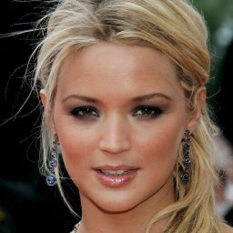

# Balanced Pioneer Networks


<br/>



<br/>


Code for the paper ["Towards Photographic Image Manipulation with Balanced Growing of Generative Autoencoders"](https://arxiv.org/abs/1904.06145) [1].
Implementation by Ari Heljakka, based on [2] (which used [3,4] and the h5tool from [5]).

The master branch of this repository may continue to be updated, and is not guaranteed compatible with the pre-trained models of [1].

## Pre-requisites

Tested with:
* Python 3.6.5
* CUDA v9.0.176
* PyTorch v0.5.0a0

The batch sizes have been selected to enable running on 12 GB of GPU memory. Note that due to PyTorch [12671](https://github.com/pytorch/pytorch/issues/12671), 1-GPU setup is the most reliable option for training. When training, please ensure enough disk space for checkpoints.

For detailed Python package configuration used, see requirements.txt.

## Pre-trained models

[Pre-trained models](https://drive.google.com/drive/folders/1EMursCOaU713diuK6aRUHR_sNrvPT67F?usp=sharing) are available for each dataset.
You can run them on command line with the [usage](#usage) examples below, inserting the proper dataset name (e.g. `-d celebaHQ`), path name (e.g. `--save_dir CelebAHQ`) and checkpoint ID (e.g. `--start_iteration=36200000`).

## Datasets

To reconstruct & interpolate external face images, or produce random samples, you only need the pre-trained models.
Please note that the input face images must be cropped and aligned as in CelebA-HQ.

You need the datasets only for training or for reproducing the reconstruction results shown on the paper.

Supported datasets are:
- LSUN bedrooms
    - Please bear in mind the very long time on first run of any LSUN usage to just build the index (for the training, can take hours).
- CelebA-HQ
    - You need to put the dataset in H5 format for PyTorch, separately for training and testing, as follows:
        1) Download the CelebA dataset (originals, NOT the aligned & cropped one)
        2) Download the Delta files from the author https://github.com/tkarras/progressive_growing_of_gans (see "Data files needed to reconstruct the CelebA-HQ dataset")
        3) Run the dataset-tools/h5tool.py we provide (which contains the train/test split unlike the original CelebA-HQ script). For the syntax, run
            ```
            python h5tool.py -h
            ```
        Please run first `data_split=train`, then `data_split=test`. This will create a separate 27k/3k split for training and testing.

## Dependencies
```
pip install -r requirements.txt
```
If you use TensorboardX, please run
```
pip install tensorboardx
```
Otherwise, you need to provide the command-line argument `--no_TB`.

## Usage

For all command-line arguments, run
```
python -m pioneer.train -h
```

Below, examples for typical use cases are given. For other arguments, the defaults should be fine.

To resume training from a checkpoint, it is sufficient to add `--start_iteration==N` where N is the step number of your latest state file (eg. for `checkpoint/256000_state`, N=256000) or `--start_iteration==-1` to use the latest check point in your `save_dir`.

Note that you need to place both the checkpoint (`_state` file) and the U matrix snapshot (`_SNU` file) in the checkpoint directory (both found in the pretrained model .zip archives). This will exactly replicate the correct U matrix used by the spectral norm; otherwise, the matrix needs to be re-calculated [6], which can be attempted by starting with a dry run.

## Testing

You can test trained models by giving its directory as `save_dir`. The checkpoints are saved under `[save_dir]/checkpoint`.
All examples show a sample checkpoint step count in the `--start_iteration` argument.

When using the pre-trained models (or replicating the earlier training runs), use `--e_last_relu --n_generator=2`. Otherwise, for training, we recommend `--n_generator=1`.

### Intermediate samples, reconstructions and interpolations using pre-trained models:

CelebA-HQ, 256x256:
```
python -m pioneer.train -d celebaHQ --start_iteration=25480000 --save_dir celebaHQ256 --test_path /data/celeba_test.h5 --sample_N=256 --reconstructions_N=10 --interpolate_N=3 --max_phase=6 --e_last_relu --testonly
```

### Intermediate samples only:

1. CelebA-HQ, 256x256:
```
python -m pioneer.train -d celebaHQ --start_iteration=25480000 --save_dir celebaHQ256 --sample_N=16 --max_phase=6 --e_last_relu --testonly
```

2. LSUN, 256x256:

```
python -m pioneer.train -d lsun --start_iteration=25400000 --save_dir lsun256 --sample_N=128 --max_phase=6 --e_last_relu --testonly
```

### Test reconstruction and interpolations of existing (any) images, with pre-trained models:

CelebAHQ 256x256:

```
python -m pioneer.train -d celebaHQ --start_iteration=25480000 --save_dir celebaHQ256 --reconstructions_N=10 --interpolate_N=6 --max_phase=6 --testonly --aux_inpath [my-image-path] --e_last_relu  --aux_outpath celebaHQ/out256
```

Note that, for legacy reasons, images must be found at ```my-image-path/sub-directory-name/*.png``` where ```sub-directory-name``` can be anything. ```reconstructions_N``` must not exceed the number of input files available.

### Dump training samples:

Dump a subset of a training (or testing) set as separate images, for computing Fréchet Inception Distance and other metrics. You can vary the exact phase and alpha to see the fade-in effects.

1. LSUN, 256x256:
```
python -m pioneer.train -d lsun --dump_trainingset_N=20 --dump_trainingset_dir=refLSUN_20 --start_phase=6 --max_phase=6 --force_alpha=1.0 --train_path /data/lsun
```
2. CelebA-HQ, 256x256:
```
python -m pioneer.train -d celebaHQ --dump_trainingset_N=20 --dump_trainingset_dir=refCAHQ_20 --start_phase=6 --max_phase=6 --force_alpha=1.0 --train_path  /data/celeba_train.h5
```

## Training

Training will need to use the pre-configured scheduler. For new datasets, you can configure the schedule of phases, margin values and learning rates in `makeTS(...)` method of `train.py`. See the existing code for how to set them up.

The resolutions of each phase are defined in powers of 2, as follows:
0 = 4x4,
...,
3 = 32x32,
4 = 64x64,
5 = 128x128,
6 = 256x256

Note that all loss function hyper-parameters in the code base are scaled by a factor of 0.1 in comparison to the paper.

Training of CelebAHQ is very stable, but with other datasets, unstable outcomes are possible (requiring restart). In all cases, you should use the last checkpoint with stable-looking samples (and best FID).

1. CelebA-HQ, 256x256:
```
python -m pioneer.train -d celebaHQ --save_dir celebaHQ_quicktest --train_path /data/celebaHQ_train.h5 --test_path /data/celebaHQ_test.h5 --sample_N=16 --reconstructions_N=8 --interpolate_N=0 --max_phase=6 --n_generator=1 --total_kimg=30000
```

2. LSUN Bedrooms, 256x256:

```
python -m pioneer.train -d lsun --save_dir lsun_quicktest --train_path /data/celebaHQ_train.h5 --test_path /data/celebaHQ_test.h5 --sample_N=16 --reconstructions_N=0 --interpolate_N=0 --max_phase=6 --n_generator=1--total_kimg=30000
```

In order to resume training from the existing (latest) checkpoint, remember to use `--start_iteration=-1`.

## Support

For all correspondence, please contact ari.heljakka@aalto.fi.

Support and email replies are not always guaranteed, but we will appreciate and evaluate all feedback.

## References

[1] Heljakka, A., Solin, A., Kannala, J.: Towards Photographic Image Manipulation with Balanced Growing of Generative Autoencoders. In: 2020 IEEE Winter Conference on Applications of Computer Vision, to appear. https://arxiv.org/abs/1904.06145

[2] https://github.com/heljakka/pioneer

[3] https://github.com/rosinality/progressive-gan-pytorch

[4] https://github.com/DmitryUlyanov/AGE

[5] https://github.com/tkarras/progressive_growing_of_gans

[6] Miyato, T., Kataoka, T., Koyama, M., and Yoshida, Y. Spectral normalization for generative adversarial networks. In Proceedings of the International Conference on Learning Representations (ICLR), 2018.

## License

This software is distributed under the MIT License; please refer to the file LICENSE, included with the software, for details.

## Referencing

Please cite our work as follows:

```
@inproceedings{Heljakka+Solin+Kannala:2019,
      title = {Towards Photographic Image Manipulation with Balanced Growing of Generative Autoencoders},
     author = {Heljakka,Ari and Solin, Arno
               and Kannala, Juho},
  booktitle = {IEEE Winter Conference on Applications of Computer Vision (WACV)},
       year = {2020}
}
```
